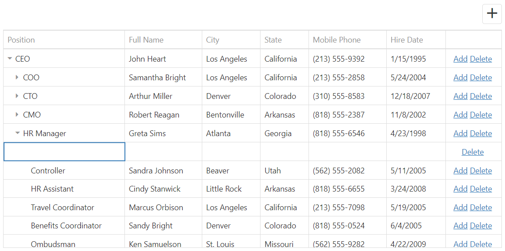

<!-- default badges list -->

<!-- default badges end -->

# TreeList for DevExtreme - How to perform CRUD operations on a hierarchical data source

If the dxTreeList.dataStructure option is set to "tree", and the editing option is enabled, the "E4009 - Data item cannot be found" error occurs while trying to edit child items. Here is a sample page illustrating this error. It indicates that the specified key is not found even if the key is present in data and correct. This can be confusing. The cause of this issue is that  TreeList editing does not work with hierarchical data. Refer to this documentation page. At the current, our dataSource can't perform the create, edit and delete operations on hierarchical data, so it throws the E4009 error.

If you need to edit hierarchical data using TreeList, it is necessary to implement the CustomStore's insert, remove, and update methods manually.

## Files to Review

- **jQuery**
  - [index.html](./index.html)
  - [index.js](./js/index.js)

## Documentation

- [Getting Started with TreeList](https://js.devexpress.com/Documentation/Guide/UI_Components/TreeList/Getting_Started_with_TreeList/)

- [TreeList - API Reference](https://js.devexpress.com/Documentation/ApiReference/UI_Components/dxTreeList/)
