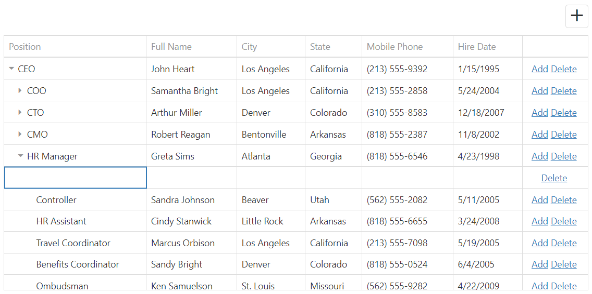

<!-- default badges list -->

<!-- default badges end -->
# TreeList for DevExtreme - How to perform CRUD operations on a hierarchical data source

If the [dataStructure](https://js.devexpress.com/Documentation/ApiReference/UI_Components/dxTreeList/Configuration/#dataStructure) option is set to "tree", and the [editing](https://js.devexpress.com/Documentation/ApiReference/UI_Components/dxTreeList/Configuration/editing/) option is enabled, the "E4009 - Data item cannot be found" error occurs while trying to edit child items. It indicates that the specified key is not found even if the key is present in data and correct. This can be confusing. The cause of this issue is that TreeList editing does not work with hierarchical data out of the box: the underlying data source cannot perform the create, update, and delete operations on hierarchical data, so it throws the E4009 error.

If you need to edit hierarchical data using TreeList, implement the [CustomStore](https://js.devexpress.com/Documentation/ApiReference/Data_Layer/CustomStore/)'s `insert`, `remove`, and `update` methods manually. This example shows how to do that.

## Files to Review

- **jQuery**
    - [index.js](jQuery/src/index.js)
- **Angular**
    - [app.component.html](Angular/src/app/app.component.html)
    - [app.component.ts](Angular/src/app/app.component.ts)
- **Vue**
    - [HomeContent.vue](Vue/src/components/HomeContent.vue)
- **React**
    - [App.tsx](React/src/App.tsx)
- **ASP.NET Core**
    - [Index.cshtml](ASP.NET%20Core/Views/Home/Index.cshtml)

## Documentation

- [Getting Started with TreeList](https://js.devexpress.com/Documentation/Guide/UI_Components/TreeList/Getting_Started_with_TreeList/)
- [TreeList - API Reference](https://js.devexpress.com/Documentation/ApiReference/UI_Components/dxTreeList/)
- [CustomStore](https://js.devexpress.com/Documentation/ApiReference/Data_Layer/CustomStore/)
<!-- feedback -->
## Does This Example Address Your Development Requirements/Objectives?

 

(you will be redirected to DevExpress.com to submit your response)
<!-- feedback end -->
